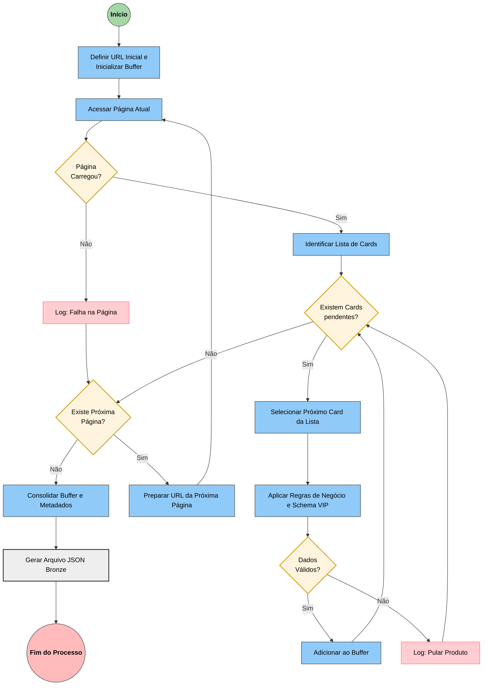
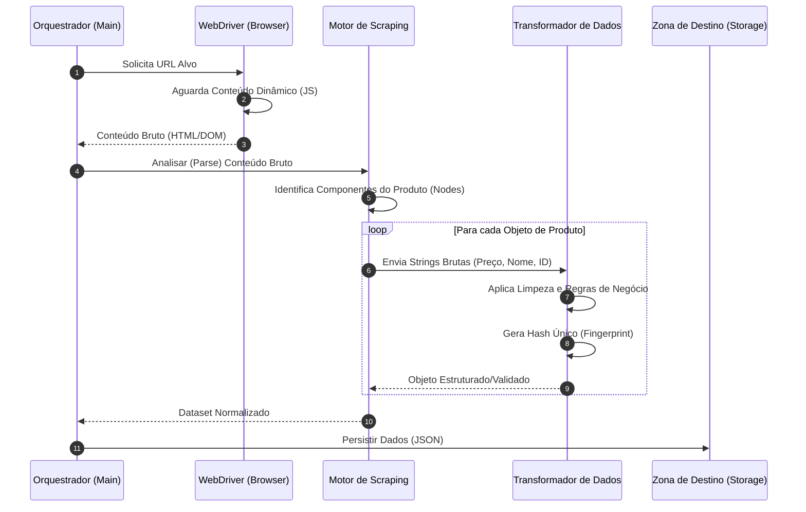
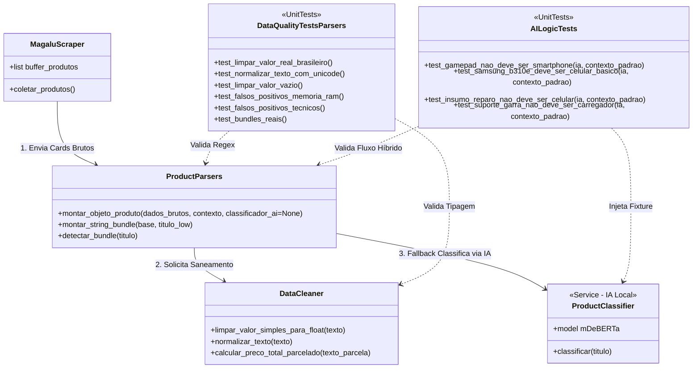

%md

# 🛒 Monitoramento de Preços E-commerce - Magalu

Este projeto implementa um pipeline de engenharia de dados end-to-end voltado à coleta e análise de produtos do e-commerce da Magazine Luiza. A solução realiza web scraping automatizado, aplica classificação de categorias por meio de modelos de Inteligência Artificial executados localmente e organiza os dados em um schema analítico padronizado (Schema VIP), garantindo consistência, rastreabilidade e prontidão para consumo em plataformas de Big Data como o Databricks.

## 📐 Arquitetura da Solução

O robô utiliza uma estrutura de **Buffer & Parsing**, garantindo que o dado seja validado e estruturado no "Schema VIP" antes mesmo de ser salvo no disco (Camada Bronze).

### Diagrama Flowchart



### Diagrama de Sequência



### Diagrama de Classes



## 🕸️ Funcionalidades

- **Web Scraping:** Utiliza Selenium com técnicas de evasão de bot (User-Agents dinâmicos, modo incognito e exclusão de flags de automação).
- **Deep Data Extraction:** Captura dados sobre os produtos vendidos na plataforma e identifica se o produto é de venda direta ou Marketplace (ex: Carrefour, Samsung) através da análise de metadados da URL.
- **Classificação com IA Local:** Utiliza o modelo `mDeBERTa-v3` básico (via Hugging Face Transformers) para classificar produtos em categorias sem custo de API e com alta precisão (Zero-Shot Classification).
- **Detecção de Bundles:** Lógica inteligente para identificar combos de produtos (chamados "bundles" na mesma proposta de venda do produto - ex: Relógio + Fone), tratando falsos positivos técnicos.
- **Metadata de Auditoria:** Cada registro contém informações de versão do pipeline, ambiente (dev/prod) e timestamp, garantindo linhagem de dados.
- **Schema VIP Profissional:** Estrutura de JSON aninhada que separa dados de produto, precificação detalhada (PIX, Crédito, Parcelamento) e fontes.

## 🛠️ Tecnologias Utilizadas

- **Linguagem:** Python 3.10+
- **Automação:** Selenium & BeautifulSoup4
- **IA/ML:** Hugging Face Transformers & PyTorch
- **Configuração:** Python-dotenv (Variáveis de Ambiente)
- **Data Lake: (Em progresso)** Integração com Databricks (Medallion Architecture).

## 📁 Estrutura do Projeto

```text
├── data/raw/             # Arquivos JSON brutos coletados
├── src/
│   ├── models/
│   │   └── classifier.py # Lógica de IA (NLP) para categorias
│   ├── parsers.py        # Tratamento de dados e Schema VIP
│   ├── scraper.py        # Motor de busca e navegação Selenium
│   └── utils.py          # Ferramentas auxiliares (logs, timestamps)
├── tests/                # Suíte de testes automatizados
│   ├── test_ai_logic.py  # Validação de inferência e categorias feita pela IA
│   └── test_parsers.py   # Validação de saneamento e regex
├── .env                  # Variáveis de ambiente (não versionado)
├── .gitignore            # Proteção de arquivos sensíveis
├── main.py               # Ponto de entrada da aplicação
└── requirements.txt      # Dependências do projeto
```

## ⚙️ Instruções de Configuração

**1. Pré-requisitos**

- Python instalado
- Google Chrome instalado

**2. Pré-requisitos**

Clone o repositório e instale as dependências:

- `git clone [https://github.com/mvinis/monitoramento-precos-magalu.git](https://github.com/mvinis/monitoramento-precos-magalu.git)`

- `cd monitoramento-precos-magalu`

- `python -m venv venv`

- `source venv/bin/activate`
- No Windows: `.\venv\Scripts\activate`

- `pip install -r requirements.txt`

**3. Variáveis de Ambiente**

Crie um arquivo `.env` na raiz do projeto:

**Snippet de código**

`PIPELINE_VERSION=v1.2`

`ENVIRONMENT=prod`

`COLLECTION_TYPE=web_scraping`

**4. Execução**

Para iniciar a coleta dos dados dos produtos, basta rodar:

`python main.py`

> Nota: Na primeira execução, o script realizará o download do modelo de linguagem (mDeBERTa) automaticamente. Certifique-se de ter espaço em disco (~500MB) e conexão com a internet. O mDeBERTa é um modelo de Inteligência Artificial treinado para entender o significado profundo de textos em diversos idiomas, inclusive o português. Ele é necessário para analisar os nomes dos produtos e decidir, de forma inteligente e sem regras manuais (fixadas no código), em qual categoria cada item se encaixa (ex: Smartphones, Acessórios ou Áudio).

## 🧪 Qualidade e Testes

Para garantir a integridade dos dados e a resiliência das transformações (especialmente no tratamento de valores monetários brasileiros e caracteres Unicode), o projeto possui uma suíte de testes unitários automatizados.

**1. O que é testado?**

- **Saneamento de Moeda**: Validação da conversão de strings (ex: R$ 1.299,50) para o tipo float (1299.5).

- **Normalização Unicode**: Verificação da remoção de caracteres invisíveis (\xa0) comuns em raspagens web.

- **Resiliência de Parsing**: Garantia de que entradas nulas ou inválidas não quebrem o pipeline (retorno padrão 0.0).

- **Blindagem de Bundles**: Validação de que "8GB+8GB RAM" não é detectado como combo.

- **Priorização de Hardware**: Garante que "Relógio + 7 Pulseiras" mantenha a categoria 'Smartwatch'.

- **Dupla Verificação do resultado da IA**: Por meio do `test_ai_logic.py`, é feito alguns testes se os produtos que eventualmente foram classificados pela IA, estão coerentes de fato.

**2. Como rodar os testes**

Certifique-se de que o ambiente virtual está ativo e execute:

`python -m pytest -v`

> Esse comando é necessário, pois o `pytest` executa os testes a partir da pasta `tests` e, por padrão, não reconhece a pasta `src` no `PYTHONPATH`, impedindo a importação das funções. Por isso, é necessário utilizar `python -m` no início do comando. E `-v`é para ver as funções exatas de cada arquivo.
